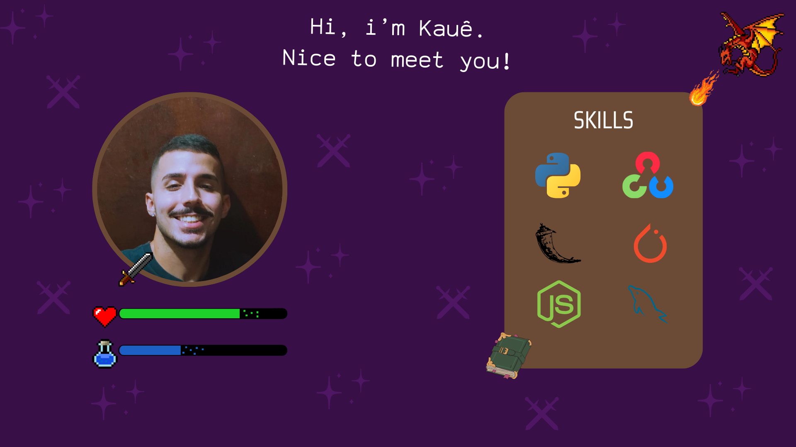

## <b>Hello, world!</b> 👋

 

<kbd>  </kbd>

 

### 👨‍💻 <b>About me:</b>

 I'm Kauê Francisco, a Multi-plataform Software Development student and a software developer interested in Computer Vision, Artificial Intelligence and Cybersecurity. 

 

### <b>📈 GitHub Statistics</b>

 

### 🛠️<b>Languages-Frameworks-Tools</b> 🛠️

 

### <b>📫 How to Reach Me</b>

 

### 👋 Thanks Visiting!
<o>Thanks for stopping by. Feel free to explore my repositories and projects. If you find something interesting or have any suggestions, don't hesitate to get in touch. Have a nice one day!🤝
